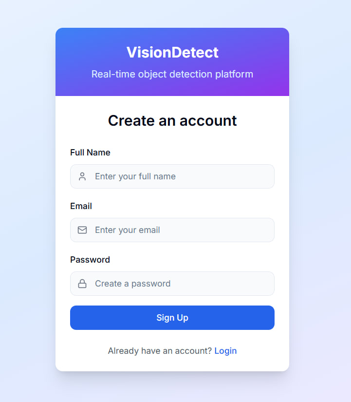
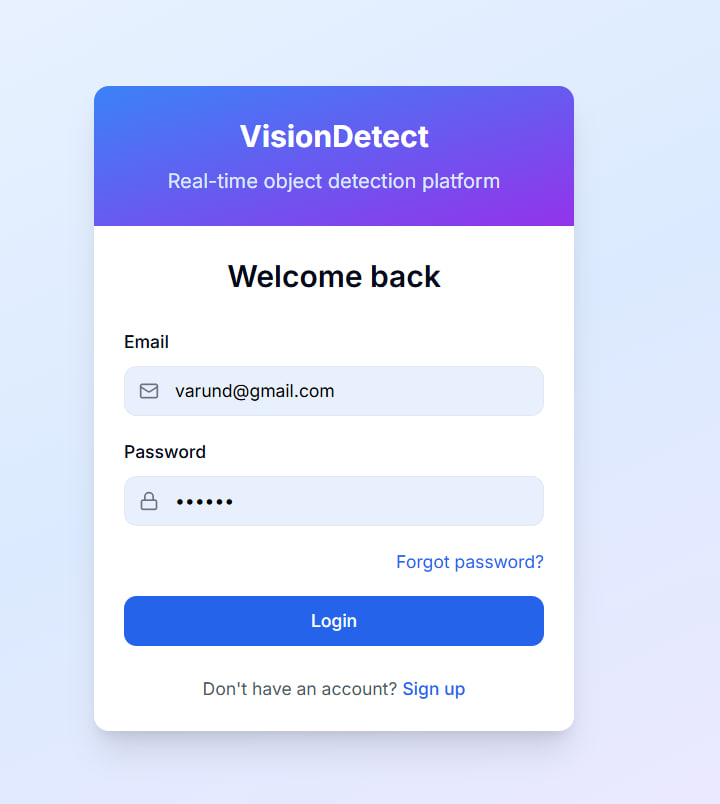
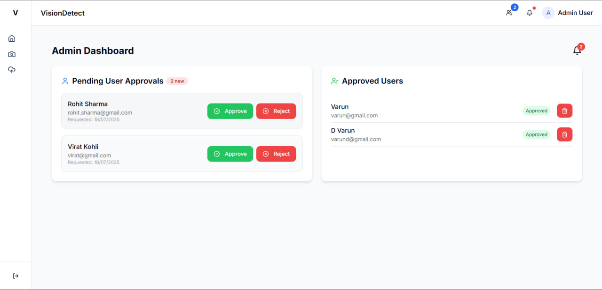
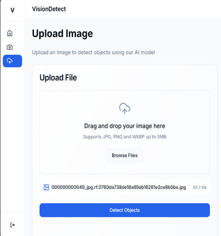
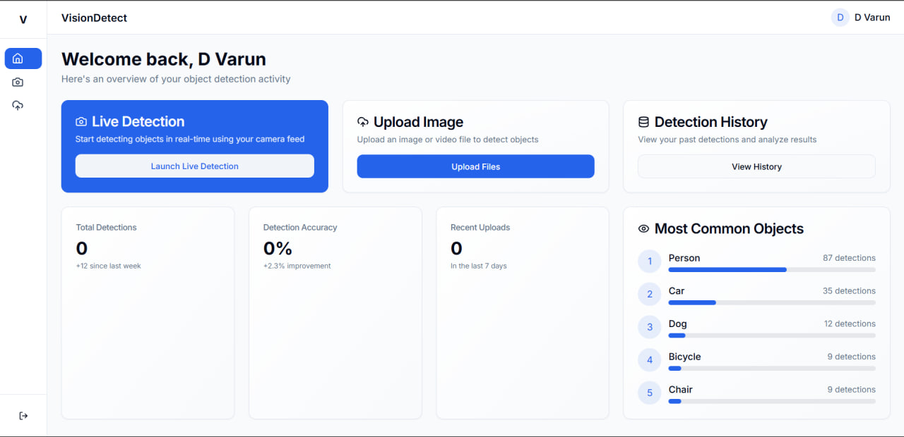

# 🚀 Portable Object Detection in Real-Time

This is a production-ready full-stack web application that enables real-time object detection using a custom-trained YOLOv8 model. Built with React (frontend), Flask (backend), and deployed using **Vercel** and **Render**, this project demonstrates modern AI-integrated software engineering practices.

---

## 🎯 Key Features

- 🔍 Real-Time Object Detection using YOLOv8 (custom-trained in Google Colab)
- 📸 Detect objects from uploaded images or live camera
- 🔐 Admin approval system with user roles and login
- 💾 Persistent user data via `users.json` (no database required)
- 🌐 Seamless deployment: Frontend on **Vercel**, Backend on **Render**

---

## 🧠 Model Training

The model used here was **trained from scratch** using Ultralytics' YOLOv8 in **Google Colab**.

### 📚 Training Workflow:

1. Dataset prepared and labeled via Roboflow (exported in YOLOv8 format)
2. Trained using `ultralytics` in Google Colab (GPU runtime)
3. Exported the best model as `best.pt` (replaces `yolov8n.pt`)
4. Integrated directly into the backend

```python
# app.py
from ultralytics import YOLO
model = YOLO("best.pt")
```

---

## 🖥️ Application Flow (Screenshots)

### 🔑 Step 1: User Signup / Login



### 🛡️ Step 2: Admin Dashboard (Pending & Approved Users)


### 📁 Step 3: Upload Images for Detection


### 📸 Step 4: View Detection Results


### 🧑‍💼 Step 5: User Dashboard (Access Detection Features)


---

## 🛠️ Tech Stack

| Layer      | Technology           |
|------------|----------------------|
| Frontend   | React + Tailwind CSS |
| Backend    | Flask + YOLOv8       |
| Model      | YOLOv8 (custom-trained) |
| Deployment | Vercel (frontend), Render (backend) |

---

## 🔐 Admin Workflow

- New users sign up → stored in `users.json` as `pending`
- Admin reviews users from **admin dashboard**
- Approved users get full access to detection features

---

## 📁 Folder Structure

```bash
Portable-Object-Detection/
│
├── frontend/                # React app
├── backend/                 # Flask app
│   ├── app.py               # Main entry point
│   ├── users.json           # Persistent user data
│   ├── best.pt              # Custom-trained YOLOv8 model
│   └── requirements.txt     # Python dependencies
├── assets/                  # Screenshots for README
└── README.md                # Project documentation
```

---

## 💼 Why This Project Matters

> A full-stack showcase of **AI-powered web applications** that combines:
> - 💡 Machine learning integration (YOLOv8)
> - 🧩 REST API design with Flask
> - 🌐 UI development with React
> - 🚀 Deployment skills with Vercel & Render  
>
> This is the kind of work that demonstrates readiness for **real-world projects at scale**.

---

## 👨‍💻 Author

**Varun D**  
📍 Hyderabad, India  
🎓 Final Year B.Tech @ ACE Engineering College  
📧 [varunmudiraj154@gmail.com](mailto:varunmudiraj154@gmail.com)  
🔗 [GitHub Profile](https://github.com/dvarunmudiraj)

---

## 🏁 Final Note

If you're an MNC or a tech company hiring for **AI Engineers**, **Web Developers**, or **Full Stack ML Engineers** — this project reflects a strong foundation in building intelligent, production-ready systems.

---

⭐ Star this repo if you find it useful or inspiring!
